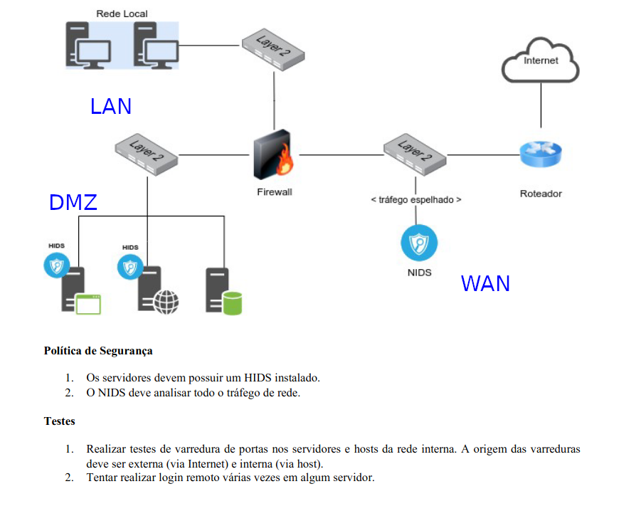
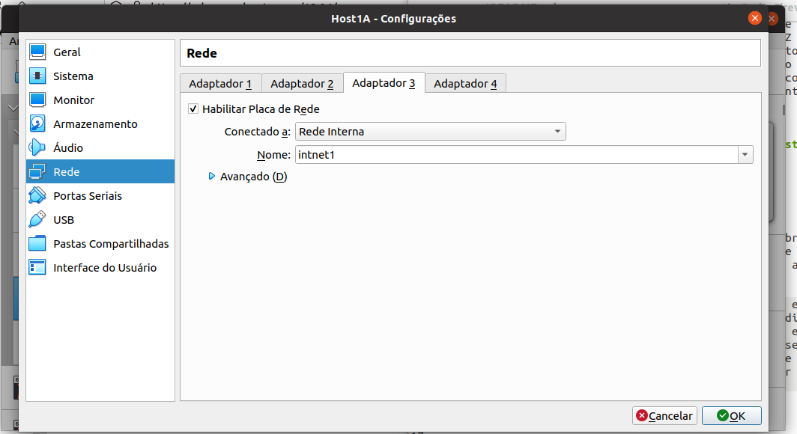
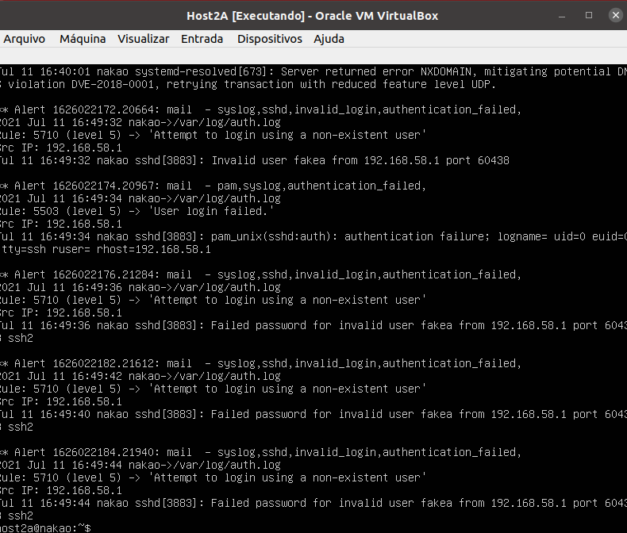

# Prática de configuração de IDS
Esse é um projeto de configuração de sistemas de detecção de intrusão em um ambiente de virtualização, foram utilizadas 5 VM's Ubuntu 18.04 (servidor), sendo 4 hosts e um roteador que contém as políticas de Firewall. A Figura 1 ilustra o cenário de rede a configurar, na qual são apresentadas as redes LAN, DMZ e WAN. As redes da LAN e DMZ estão atrás do Firewall, ou seja, todo tráfego que sair do Firewall deve ser mascarado através do uso de mascáramento NAT. O Host 4 e o Firewall tem acesso a internet, o acesso a Internet para LAN e DMZ passam pelo Firewall. Também são apresentadas 7 políticas de segurança a serem implementadas.

<p>
  
  <p align="center">Figura 1 - Cenário proposto</p>
</p>
<br>

# Carregamento das VM's no virtualbox
Faça o download da imagem do Ubuntu 18.04 (server), abra o Virtualbox, clique em "Novo", nomeie a VM de host1a, selecione o tipo Linux, escolha a versão Ubuntu (64 bits), selecione uma quantidade de memória RAM, crie e defina o tamanho do disco virtual e conclua a criação inicial da VM.

Uma vez criada, aperte o botão direito do mouse na VM e selecione a opção configurações. Vá no menu Sistema, e deixe o disco óptico no topo da ordem de boot. Agora vá ao menu armazenamento, acrescente um disco na opção "Controladora:IDE", selecione o disco existente com o cursor do mouse, a direita aparecerá uma seção de atributos, nela haverá um ícone de um disco azul, clique com o botão direito nele e carregue a ISO do Ubuntu Server.

Feito isso, vá ao menu Rede e habilite uma placa de rede, selecione a opção Rede interna, e se atente ao nome da rede em que essa placa está conectada. Para se obter o resultado esperado, máquinas na mesma rede devem estar no mesmo nome de rede. A Figura 2 ilustra essa configuração.

<p>
  
  <p align="center">Figura 2 - Habilitando placa de rede </p>
</p>
<br>


Agora abra mais uma vez o menu Configurações->Sistema, e deixe o disco rígido no topo da lista de sequência de boot. Finalmente ligue a máquina virtual, defina o seu usuário, e execute os comandos:
```bash
sudo apt install apache2
sudo apt install openssh-server
sudo apt install lynx
sudo apt install ftp
sudo apt install iptables
sudo apt install bind9
sudo apt install proftpd
sudo apt install telnetd
```

Para poupar trabalho, iremos clonar essa primeira maquina virtual 4 vezes, se atente as opções para gerar novos discos virtuais e novos endereços MAC para as placas de rede. Feche a VM carregada e realize as clonagens, basta clicar com o botão direito na VM e clonar (seguindo os menus).

Agora iremos criar uma Rede NAT, para isso vá em Arquivo->Preferências->Rede e crie uma Rede NAT.

Terminadas as clonagens, renomeie as VM's para: host1a, host1b, host2a, host3a e Firewall. Em seguida, iremos ativar as interfaces de rede do nós (tal qual na Figura 2), nas VM's LAN (host1a, host1b) e DMZ (host2a) habilite uma placa de rede interna, na VM da WAN (host3a) habilite uma placa de de rede interna NAT, na VM do Firewall habilite duas placas de rede interna e uma Rede NAT.

Nas máquinas da LAN (host1a e host1b), o nome associada a placa de rede será intnet1, na máquina da DMZ (host2a) o nome será intnet2, na placa de rede interna da WAN (host3a) estará conectada a uma Rede NAT, por fim, na VM do Firewall nomeie a primeira placa de rede interna com a intnet1, a segunda com intnet2 e a terceira com a mesma Rede NAT do host3a. A tabela 1 apresenta as redes internas das VM's.

| VM        | Redes Internas |
| ------------- |:-------------:|
| host1a (LAN)        | intnet1 |
| host1b (LAN)     | intnet1     |  
| host2a (DMZ) | intnet2      |
| host3a (WAN) | Rede NAT |
| Firewall | intnet1, intnet2, Rede NAT |    
 <p align="center">Tabela 1 - Placas de rede </p>

# Configuração das redes nas VM's
Iremos configurar as redes de acordo com o cenário  apresentado na Figura 1, as redes são apresentadas na Tabela 2, na qual as máquinas da LAN estão na rede 172.16.1.0, da DMZ na rede 172.16.2.0 e da WAN em uma Rede NAT, nessa prática deixamos explícitos os nomes de algumas interfaces de rede que serão utilizadas nas regras do Firewall.
| VM        | Rede | Ip |
| ------------- |:-------------:|:-------------:|
| host1a (LAN)        | 172.16.1.0/24 | 172.16.1.1|
| host1b (LAN)     | 172.16.1.0/24     |  172.16.1.2|
| host2a (DMZ) | 172.16.2.0/24      |172.16.2.1|
| host3a (WAN) | Rede NAT (enp0s3) | 10.0.2.4 (Gerado por dhcp) |
| Firewall | 172.16.1.0 (enp0s9), 172.16.2.0 (enp0s10), Rede NAT (enp0s8) | 172.16.1.254 (enp0s9), 172.16.2.254 (enp0s10), 10.0.2.5 (enp0s8) |
 <p align="center">Tabela 2 - Redes das VM's </p>

Para realizar as configurações, inicie todas as VM's e edite o arquivo /etc/netplan/00-installer-config.yaml, iremos passar pelas configurações de rede de cada VM.

## Arquivo /etc/netplan/00-installer-config.yaml do host1a
```bash
network:
  ethernets:
    enp0s9:
      dhcp4: no
      addresses: [172.16.1.1/24]
      gateway4: 172.16.1.254
      nameservers:
        addresses: [8.8.8.8]  
  version: 2
```
## Arquivo /etc/netplan/00-installer-config.yaml do host1b
```bash
  network:
    ethernets:
      enp0s9:
        dhcp4: no
        addresses: [172.16.1.2/24]
        gateway4: 172.16.1.254
        nameservers:
          addresses: [8.8.8.8]
    version: 2
```
## Arquivo /etc/netplan/00-installer-config.yaml do host2a
```bash
network:
  ethernets:
    enp0s9:
      dhcp4: no
      addresses: [172.16.2.3/24]
      gateway4: 172.16.2.254
      nameservers:
        addresses: [8.8.8.8]
  version: 2
```
## Arquivo /etc/netplan/00-installer-config.yaml do host3a
```bash
network:
  ethernets:
    enp0s3:
      dhcp4: true  
    enp0s8://Interface usada para acesso SSH externo a VM
      dhcp4: true  
  version: 2
```
## Arquivo /etc/netplan/00-installer-config.yaml do Firewall
```bash
network:
  ethernets:
    enp0s8:// WAN/INTERNET
      dhcp4: true
    enp0s9: //LAN
      dhcp4: no
      addresses: [172.16.1.254/24]
    enp0s10://DMZ
      dhcp4: no
      addresses: [172.16.2.254/24]
    version: 2
```

## Ligando roteamento  no firewall
Agora ligaremos ligaremos o modo de roteamento para o firewall, nessa configuração o Firewall é quem possui uma interface com acesso à Internet, e ele que de fato irá ceder aos nós da LAN e DMZ. Para isso, no firewall e no host3a abra o arquivo /etc/sysctl.conf, e acrescente a linha abaixo:
```bash
net.ipv4.ip_forward=1
```

## Alterando o index.html dos nós
Nos testes, precisaremos testar o acessos HTTP nos nós, convém mudar a página padrão dos hosts para facilitar, em cada nó, altere o arquivo /var/www/index.html, deixando uma mensagem de "Bem vindo ao host X" ou "Bem vindo ao firewall". O apache estará rodando em todas as máquinas executadas, dessa forma em todo acesso http bem sucedido será possível visualizar claramente se ele foi barrado ou não.

## Configuração do host3a (DMZ)
Agora vamos acrescentar rotas para as redes LAN e DMZ para o host3a, usando os comandos:
```
host3a@nakao:~$ sudo ip route add 172.16.1.0/24 via 10.0.2.5
host3a@nakao:~$ sudo ip route add 172.16.2.0/24 via 10.0.2.5
```

# Configuração do Firewall
Chegamos as configurações realizadas no Firewall, para isso criaremos um único arquivo executável que conterá todas políticas de segurança, abaixo segue o arquivo rules.sh, que contém
as regras do firewall. Iniciamos as regras, sendo:
* Zerar as tabelas do Firewall
* Permitir que o host1a acesse o Firewall via ssh

## Arquivo rules.sh
```bash
echo "limpando as tabelas iptables"
iptables -t nat -F
iptables -F

echo "ligando mascaramento para tudo que sair para internet"
iptables -t nat -A POSTROUTING -o enp0s8 -j MASQUERADE

echo "Permitindo acesso ssh pelo host1a"
iptables -A INPUT -p tcp --dport 22 -i enp0s9 -s 172.16.1.1 -j ACCEPT
iptables -A INPUT -j DROP
```

Para executarmos o script, devemos torná-lo um executável e executá-lo, fazendo:
```
firewall@nakao:~$ sudo chmod a+x ./rules.sh
firewall@nakao:~$ sudo ./rules.sh
```

# Configuração do Network IDS Suricata no host3a
```
sudo apt-get install software-properties-common
sudo add-apt-repository ppa:oisf/suricata-stable
sudo apt-get update
sudo apt-get install suricata
sudo apt install jq
sudo apt install python-pip
sudo pip install --upgrade suricata-update
sudo suricata-update

sudo vi /etc/suricata/suricata.yaml
procurar af-packet, e trocar a interface para a enp0s3
af-packet:
  - interface: enp0s8
pcap:
  - interface: enp0s8

Além disso, alterar no HOME_NET: "[192.168.0.0/16,10.0.0.0/8,172.16.0.0/12]"
```

# Configuração do Hosts IDS OSSEC na DMZ (host2a)
```
sudo apt install -y wget unzip make gcc build-essential
sudo apt install -y php php-cli php-common libapache2-mod-php apache2-utils sendmail inotify-tools
export VER="3.1.0"
wget https://github.com/ossec/ossec-hids/archive/${VER}.tar.gz
tar -xvzf ${VER}.tar.gz

cd ossec-hids-${VER}
sudo sh install.sh
1-What kind of installation do you want (server, agent, local, hybrid or help)?
host2a@nakao: local
2- Setting up the installation environment.

 - Choose where to install the OSSEC HIDS [/var/ossec]:
host2a@nakao: [ENTER]
3- Configuring the OSSEC HIDS.

3.1- Do you want e-mail notification? (y/n) [y]:
host2a@nakao: n
3.2- Do you want to run the integrity check daemon? (y/n) [y]:
host2a@nakao: n
3.3- Do you want to run the rootkit detection engine? (y/n) [y]:
host2a@nakao: y
3.4- Active response allows you to execute a specific
       command based on the events received. For example,
       you can block an IP address or disable access for
       a specific user.  
       More information at:
       http://www.ossec.net/en/manual.html#active-response

   - Do you want to enable active response? (y/n) [y]:
host2a@nakao:y
   - Do you want to enable the firewall-drop response? (y/n) [y]:
host2a@nakao:y
   - Do you want to add more IPs to the white list? (y/n)? [n]:
host2a@nakao:n
3.6- Setting the configuration to analyze the following logs:
       -- /var/log/auth.log
       -- /var/log/syslog
       -- /var/log/dpkg.log
       -- /var/log/proftpd/proftpd.log
       -- /var/log/apache2/error.log (apache log)
       -- /var/log/apache2/access.log (apache log)

    - If you want to monitor any other file, just change
      the ossec.conf and add a new localfile entry.
      Any questions about the configuration can be answered
      by visiting us online at http://www.ossec.net .

host2a@nakao:~$ sudo /var/ossec/bin/ossec-control start
```
# Teste de ataque no NIDS
Vamos testar um ataque DDOS usando hping, para tal, de uma máquina externa foi realizado o comando hping. Em um terminal externo, foi realizado o comando hping.
```bash
hping3 -S -p 80 --flood --rand-source 192.168.59.3
```
Como resultados, podemos dar um cat no arquivo /var/log/suricata/fast.log e temos o resultado
```bash
07/09/2021-02:00:05.214244  [**] [1:2400041:2942] ET DROP Spamhaus DROP Listed Traffic Inbound group 42 [**] [Classification: Misc Attack] [Priority: 2] {TCP} 223.169.188.61:2258 -> 192.168.59.3:80
07/09/2021-02:00:05.425981  [**] [1:2400012:2942] ET DROP Spamhaus DROP Listed Traffic Inbound group 13 [**] [Classification: Misc Attack] [Priority: 2] {TCP} 137.105.29.37:16935 -> 192.168.59.3:80
07/09/2021-02:00:05.624051  [**] [1:2400001:2942] ET DROP Spamhaus DROP Listed Traffic Inbound group 2 [**] [Classification: Misc Attack] [Priority: 2] {TCP} 42.137.68.196:27632 -> 192.168.59.3:80
```

# Teste de ataque no HIDS
 Vamos testar um acesso SSH com uma conta que não exista no HIDS, diversos acessos usando o usuario nao existente fakea foram executados, abaixo os alertas gerados pelo OSSEC.
 <p>
  
  <p align="center">Figura 1 - Cenário proposto</p>
</p>
<br>
